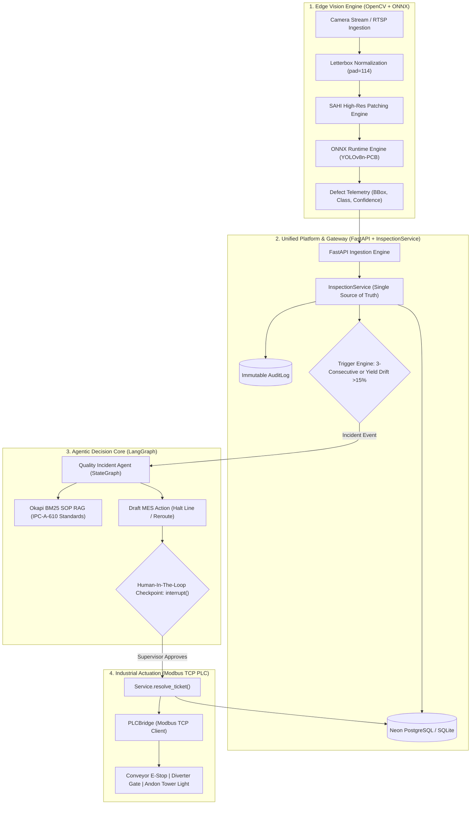

<div align="center">
  <h1>🏭 ApexInspect AI — Autonomous Industrial Vision & Quality Agent</h1>
  <p><strong>Smart Factory Vision Inspection with ONNX Edge Inference, SOP RAG & Human-In-The-Loop Governance</strong></p>

  [](https://python.org)
  [](https://fastapi.tiangolo.com/)
  [](https://opencv.org)
  [](https://onnxruntime.ai)
  [](https://langchain-ai.github.io/langgraph/)
  [](https://streamlit.io/)
  [](https://docker.com)
  [](https://github.com/imtarget05/ApexInspect-AI/actions/workflows/ci.yml)
  [](LICENSE)

  [](https://github.com/imtarget05/ApexInspect-AI/actions/workflows/ci.yml)
  [](https://github.com/imtarget05/ApexInspect-AI/actions/workflows/cd.yml)
</div>

---

**ApexInspect AI** is an enterprise-grade, edge-deployable **Smart Factory Vision & Autonomous Quality Agent** system. It bridges high-speed Computer Vision inspection on surface-mount assembly lines (SMT/PCBA) with an Agentic AI decision pipeline and real-time **Modbus TCP Industrial PLC** hardware control. When recurring or critical defects appear, the system diagnoses root causes via Okapi BM25 SOP retrieval, proposes corrective actions, and synchronizes with Manufacturing Execution Systems (**MES**) under strict **Human-In-The-Loop (HITL)** governance and immutable **Audit Trail** logging.

Core workflow: `Inspect → Detect → Diagnose → Propose → Human Approve → PLC Dispatch & MES Sync`

## ✨ Key Technical Highlights

1. **Edge Inference (ONNX Runtime + SAHI Patching)**: Exported YOLOv8 defect detection model running via ONNX Runtime CPU. The saved local benchmark records **43.36 ms average latency (23.1 FPS)** on Apple M-series macOS, using synthetic PCB frames with model input `[1, 3, 640, 640]`, 20 measurements after 5 warm-up runs (see `benchmark_results.json`). The project also includes `HighResPatchInferencer` with NMS merging; this benchmark does not establish 4K patching or end-to-end throughput. Production target: ≤35 ms on cloud 2-vCPU, not yet verified as achieved.
2. **Industrial OT & Modbus TCP PLC Bridge**: Native Modbus TCP client (`PLCBridge`) and Virtual Modbus Server (`VirtualModbusServer`) to directly control conveyor interlocks, pneumatic reject diverters, and andon tower lights (Red/Yellow/Green).
3. **Grounded IPC-A-610 SOP Knowledge Retrieval**: Okapi BM25 Hybrid RAG engine with domain-specific synonym expansion indexing standard operating procedures including IPC-A-610 Class 3 solder criteria, thermal reflow profile drift (TAL/PWI), and pick & place nozzle maintenance.
4. **Deterministic Human-In-The-Loop (HITL) Safety & Audit Trail**: LangGraph `MemorySaver` + `interrupt()` and `Command(resume=...)` primitives with dynamic thread IDs. Factory-floor actions strictly require supervisor sign-off and are recorded into an immutable `AuditLog` table.
5. **Unified Architecture & Production Gateway**: Consolidated `InspectionService` layer shared across FastAPI REST gateway and Streamlit UI, protected by `X-API-KEY` security authentication.
6. **Resilient Dual-Mode Persistence**: Native **Neon Serverless PostgreSQL** integration with automatic zero-config fallback to **SQLite** (`factory.db`) with row-level locking for seamless offline operation.

## 🏗️ System Architecture



## 📊 Benchmark & Performance

> Source of truth: `benchmark_results.json` (measured 2026-09-17 01:14:20). All numbers in this section are copied from that file.

Measured on Apple M-series (local macOS) with ONNX Runtime 1.30.0, using synthetic PCB frames via `PCBCameraSimulator` and model input `[1, 3, 640, 640]`: 20 measurements after 5 warm-up runs.

| Metric | Value |
| :--- | :--- |
| Model | `yolov8n_pcb_defect.onnx` |
| Input shape | `[1, 3, 640, 640]` |
| Output shape | `[1, 10, 8400]` |
| Warmup runs | 5 |
| Measured runs | 20 |
| **Avg latency** | **43.36 ms** |
| Min latency | 42.1 ms |
| Max latency | 50.17 ms |
| **Throughput** | **23.1 FPS** |
| Confidence threshold | 0.50 |
| Hardware | Apple M-series (local macOS) |
| ONNX Runtime | 1.30.0 |

> **Scope note**: This is a local macOS measurement. The production target of ≤35 ms/frame on cloud 2-vCPU is **not yet verified as achieved**. This micro-benchmark does not establish 4K SAHI patching or end-to-end pipeline throughput. Per-frame `inference_time_ms` is recorded in the database on every inspection for real-world latency tracking.

Run the benchmark yourself:

```bash
python scripts/benchmark_inference.py
```

Check against target (≤35 ms on cloud 2-vCPU):

```bash
python scripts/check_benchmark_target.py
```

### Local measurement vs cloud target

| Metric | Local macOS measurement | Cloud 2-vCPU target |
| :--- | :--- | :--- |
| Source | `benchmark_results.json` (2026-09-17 01:14:20) | No cloud measurement verified |
| Latency / FPS | **43.36 ms / 23.1 FPS** | **≤35 ms**, not yet verified as achieved |

**CI scope:** `.github/workflows/ci.yml` runs pytest and a Docker build smoke test. It does **not** run a latency gate or block PRs based on a >50 ms benchmark result.

## 🏗️ Architecture Decision Records (ADR)

See `docs/adr/` for formalized architectural decisions:

| # | Title | Status |
|---|-------|--------|
| 001 | BM25 (Okapi) thay vì Vector Embedding cho SOP RAG | Accepted |
| 002 | Modbus TCP + Virtual PLC Simulator cho Industrial OT | Accepted |
| 003 | ONNX Runtime + Canonical Colab-trained Weights cho Edge Inference | Accepted |

## 🔍 Observability

ApexInspect AI cung cấp metrics sau cho factory monitoring:

- **Per-frame inference latency** (`inference_time_ms`): ghi vào DB mỗi lần inspection, cho phép track real-world performance theo thời gian.
- **Yield rate**: tính từ tổng inspection / defective count, exposable qua `GET /api/v1/lines/{line_id}/metrics`.
- **Defect Pareto**: phân loại defect theo class, dùng cho quality improvement.
- **Audit trail**: mọi action (trigger, approve, reject, PLC dispatch) ghi vào `audit_logs` — immutable.
- **HITL checkpoint state**: LangGraph `MemorySaver` giữ trạng thái interrupted workflow, resume sau khi supervisor approve.

Metrics nào giảm sát khi line dừng:
- Yield rate ↓
- Consecutive defect count ≥ 3
- Inference latency ↑ (có thể부터 hardware issue)

## ⚠️ Limitations

1. **Inference speed**: 43.36 ms/frame (saved benchmark) trên local macOS — chưa đạt 35ms target. Cần benchmark trên cloud 2-vCPU thật để verify.
2. **BM25 RAG**: không semantic, phụ thuộc synonym map thủ công. Không scale với corpus lớn.
3. **Modbus TCP**: không encrypt/auth built-in — cần network-level security.
4. **Virtual PLC simulator**: không mimic real hardware timing/error behavior.
5. **SAHI patching**: slow cho 4K images (latency tổng = sum của tất cả patches). Chỉ dùng khi cần.
6. **Dataset**: gallery sample PCB từ Kaggle `akhatova/pcb-defects` — không phải production camera thực.

## 🚀 Quickstart

### 1. Clone & Setup Environment

```bash
git clone https://github.com/imtarget05/ApexInspect-AI.git
cd ApexInspect-AI

python3 -m venv .venv
source .venv/bin/activate
pip install -r requirements.txt
```

### 2. Configure Environment Variables

```bash
cp .env.example .env
# Add your GROQ_API_KEY (free at https://console.groq.com)
```

### 3. Run Locally (Streamlit All-In-One UI)

```bash
streamlit run src/ui/app.py
```

Open `http://localhost:8501` to view the live line inspection stream and incident resolution center.

## 🧪 Testing

The test suite covers the full pipeline (vision simulator + ONNX detector, FastAPI ingestion + MES tickets, SOP RAG + LangGraph agent) and runs entirely offline:

Latest verified local run (2026-09-17, `.venv/bin/python -m pytest tests/ -q`): **87 passed, 1 warning**, exit code 0, repeated twice back-to-back. The suite is green under both documented runners.

**Resolved defect — destructive test runs against the production database.** `tests/conftest.py` is a pytest-only hook, but this repo documents `python3 -m unittest discover tests/` as a co-equal runner. Under that runner `conftest.py` was never loaded, so `src/backend/database.py`'s `load_dotenv()` bound the suite to the real Neon `DATABASE_URL` from `.env`. The destructive `setUp()` in `tests/test_backend.py` then truncated production tables — the 2026-09-16 production wipe, 105s runtimes, and the SQLAlchemy `ObjectDeletedError` on `test_record_inspection_triggers_incident_on_yield_rate_drift` all trace to this single cause. Fixed by a runner-independent guard in `src/backend/database.py` that runs **before** `load_dotenv()` and forces a throwaway SQLite file whenever the process is a test runner (detection centralised in `src/runtime_flags.is_test_process`, shared with the LLM guard so the two cannot drift: `pytest in sys.modules`, `PYTEST_CURRENT_TEST`, or `__main__.__file__` ending in `unittest/__main__.py|main.py` / `pytest/__main__.py`). Production entrypoints (uvicorn, streamlit, scripts) keep their own `DATABASE_URL`. Regression tests: `tests/test_db_guard.py` (runs both runners in a subprocess against an unreachable simulated production URL) plus `tests/test_db_isolation.py`.

A second defect — ordinary unit tests made **live HTTPS calls to `api.groq.com`** (socket probe: 9 external connects; suite took 49.61s on one run vs 7.35s on the next) — is fixed by the same gate: `src/runtime_flags.effective_groq_key()` returns an empty key inside test runners, so `RCAAnalysisAgent` and `QualityIncidentAgent` take the existing deterministic RCA fallback. Opt in explicitly with `APEX_ALLOW_LIVE_LLM=1`. Regression tests: `tests/test_llm_guard.py`.

```bash
python -m pytest tests/ -q
```

## ☁️ Deployment & DevOps (CI/CD)

The platform ships with a fully automated **GitHub Actions** pipeline:

| Workflow | Trigger | Jobs |
| :--- | :--- | :--- |
| **CI** (`ci.yml`) | Push / PR → `main` | `pytest` test suite (Python 3.11) • Docker image build smoke test |
| **CD** (`cd.yml`) | Push → `main` | Build + push Docker image to **GHCR** (`ghcr.io/imtarget05/apexinspect-ai:latest`) • Trigger **Render** deploy (autoDeploy + explicit API call) |
| **Live URLs** | — | API: https://apexinspect-api.onrender.com • Dashboard: https://apexinspect-dashboard.onrender.com |

### Required Secrets & Providers

Configure under **repo → Settings → Secrets and variables → Actions**:

| Name | Type | Where to get it | Required? |
| :--- | :--- | :--- | :--- |
| `GITHUB_TOKEN` | Secret (auto) | Provided automatically by GitHub Actions | ✅ Automatic |
| `RENDER_API_KEY` | Secret | [dashboard.render.com/u/settings#api-keys](https://dashboard.render.com/u/settings#api-keys) | Only for explicit Render deploy trigger |
| `RENDER_DEPLOY_HOOK_URL` | Secret | Render → Service → Settings → Deploy Hook | Optional (alternative to API key) |
| `RENDER_SERVICE_ID` | Variable | Render → Service → Settings → Service ID (`srv-…`) | Only with the API-key path |
| `DATABASE_URL` | Runtime | [neon.tech](https://neon.tech) → Connection string | Set on **Render**, never in GitHub |
| `GROQ_API_KEY` | Runtime | [console.groq.com](https://console.groq.com) | Set on **Render**, never in GitHub |
| `API_KEY` | Runtime | Self-chosen, unlocks `POST /api/v1/mes/action` | Set on **Render**, never in GitHub |

The Render deploy job skips gracefully (exit 0) when no hook/API key is configured — Render's own
`autoDeploy: true` still ships every push to `main`, so the pipeline stays green out of the box.

 Full step-by-step runbook: [`deploy/README.md`](deploy/README.md)

## 📂 Project Structure

```text
ApexInspect-AI/
├── Dockerfile                  # Container definition for the Render Web Service (API)
├── requirements.txt            # Minimal, pinned dependencies (including pymodbus)
├── .github/workflows/          # CI/CD pipelines (ci.yml, cd.yml)
├── data/
│   ├── sops/                   # IPC-A-610 Standard Operating Procedures (SOP-001 to 006)
│   └── sample_pcbs/            # Real Kaggle PCB frames for the Live Feed gallery
├── models/                     # Single source of truth for the trained model
│   ├── yolov8n_pcb_defect.onnx # Deployed Colab-trained weights (~12 MB, git-tracked)
│   ├── train.py                # YOLOv8 training + ONNX export (Colab/GPU)
│   ├── training_data.yaml      # Exact data.yaml used for training (6 classes)
│   └── MODEL_CARD.md           # Provenance, IO shapes, thresholds, evidence
├── notebooks/                  # Colab notebook only (frozen evidence of the run)
├── scripts/                    # Ops: dataset → DB ingest, gallery rebuild, verification
├── dashboard/                  # Static operator dashboard (Render Static Site: HTML/CSS/JS, no build)
├── deploy/                     # Runbook (deploy/README.md) — Render + Neon + Groq free tier
├── src/
│   ├── vision/                 # ONNX Runtime detector, SAHI High-Res patching, RTSP stream
│   ├── industrial/             # Modbus TCP PLC Bridge & Virtual PLC Simulator Server
│   ├── agent/                  # LangGraph StateGraph, HITL interrupt/resume, BM25 RAG
│   ├── backend/                # InspectionService, FastAPI Gateway & AuditLog models
│   └── ui/                     # Streamlit console — LOCAL/Docker only (not deployed)
└── tests/                      # Unit and integration tests; latest result above
```

## 📄 License

This project is licensed under the MIT License — see the [LICENSE](LICENSE) file for details.

---

*Developed by [imtarget05](https://github.com/imtarget05)*

