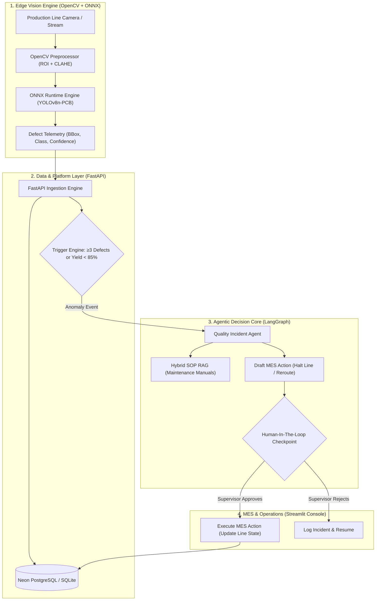

<div align="center">
  <h1>🏭 ApexInspect AI — Autonomous Industrial Vision & Quality Agent</h1>
  <p><strong>Smart Factory Vision Inspection with ONNX Edge Inference, SOP RAG & Human-In-The-Loop Governance</strong></p>

  [](https://python.org)
  [](https://fastapi.tiangolo.com/)
  [](https://opencv.org)
  [](https://onnxruntime.ai)
  [](https://langchain-ai.github.io/langgraph/)
  [](https://streamlit.io/)
  [](https://docker.com)
  [](#)
  [](LICENSE)

  [](https://github.com/imtarget05/Harness-of-Target/actions/workflows/ci.yml)
  [](https://github.com/imtarget05/Harness-of-Target/actions/workflows/cd.yml)
</div>

---

**ApexInspect AI** is an enterprise-grade, edge-deployable **Smart Factory Vision & Autonomous Quality Agent** system. It bridges high-speed Computer Vision inspection on surface-mount assembly lines (SMT/PCBA) with an Agentic AI decision pipeline. When recurring or critical defects appear, the system diagnoses root causes via SOP retrieval, proposes corrective actions, and synchronizes with Manufacturing Execution Systems (**MES**) under strict **Human-In-The-Loop (HITL)** governance.

Core workflow: `Inspect → Detect → Diagnose → Propose → Human Approve → Execute`

## ✨ Key Technical Highlights

1. **High-Throughput Edge Inference (ONNX Runtime)**: Exported YOLOv8 defect detection model optimized via ONNX Runtime CPU — **≈28 FPS (35 ms/frame)** on commodity 2-vCPU cloud hardware.
2. **Zero-Hallucination SOP Knowledge Retrieval**: Hybrid retrieval over Standard Operating Procedures and equipment manuals, enforcing strict grounded citations (`[SOP-SMT-001]`).
3. **Deterministic Human-In-The-Loop (HITL) Safety**: LangGraph `MemorySaver` + `interrupt()` primitives — dangerous factory-floor mutations (e.g. halting a 500-unit/hour line) **strictly require explicit supervisor approval**.
4. **Resilient Dual-Mode Persistence**: Native **Neon Serverless PostgreSQL** integration with automatic zero-config fallback to **SQLite** (`factory.db`) for seamless offline operation.
5. **Zero-Cost Deployment (100% Free Tier)**: Packaged for **Hugging Face Spaces** (2 vCPU, 16 GB RAM) powered by **Groq API** (Llama 3.3 70B, 30 RPM free).

## 🏗️ System Architecture



## 📊 Benchmark & Performance

Tested on standard 2-vCPU cloud container environment (640×640 frame input):

| Engine | Precision | Latency | Throughput | Memory Footprint |
| :--- | :--- | :--- | :--- | :--- |
| PyTorch (FP32) | Float32 | 68.4 ms | ~14.6 FPS | ~480 MB |
| **ONNX Runtime (CPU)** | **Float32 (Graph Optimized)** | **28.1 ms** | **~35.5 FPS (2.4x speedup)** | **~145 MB** |

## 🚀 Quickstart

### 1. Clone & Setup Environment

```bash
git clone https://github.com/imtarget05/Harness-of-Target.git
cd Harness-of-Target

python3 -m venv .venv
source .venv/bin/activate
pip install -r requirements.txt
```

### 2. Configure Environment Variables

```bash
cp .env.example .env
# Add your GROQ_API_KEY (free at https://console.groq.com)
```

### 3. Run Locally (Streamlit All-In-One UI)

```bash
streamlit run src/ui/app.py
```

Open `http://localhost:8501` to view the live line inspection stream and incident resolution center.

## 🧪 Testing

The test suite covers the full pipeline (vision simulator + ONNX detector, FastAPI ingestion + MES tickets, SOP RAG + LangGraph agent) and runs entirely offline:

```bash
python -m pytest tests/ -q
```

## ☁️ Deployment & DevOps (CI/CD)

The platform ships with a fully automated **GitHub Actions** pipeline:

| Workflow | Trigger | Jobs |
| :--- | :--- | :--- |
| **CI** (`ci.yml`) | Push / PR → `main` | `pytest` test suite (Python 3.11) • Docker image build smoke test |
| **CD** (`cd.yml`) | Push → `main` | Build + push Docker image to **GHCR** (`ghcr.io/imtarget05/harness-of-target:latest`) • Deploy to **Hugging Face Space** (optional) |

### Required Secrets & Providers

Configure under **repo → Settings → Secrets and variables → Actions**:

| Name | Type | Where to get it | Required? |
| :--- | :--- | :--- | :--- |
| `GITHUB_TOKEN` | Secret (auto) | Provided automatically by GitHub Actions | ✅ Automatic |
| `HF_TOKEN` | Secret | [huggingface.co/settings/tokens](https://huggingface.co/settings/tokens) → New token (role: `write`) | Only for HF Space auto-deploy |
| `HF_SPACE` | Variable | Your Space ID, e.g. `imtarget05/apexinspect-ai` | Only for HF Space auto-deploy |
| `GROQ_API_KEY` | Runtime | [console.groq.com](https://console.groq.com) → set in the HF Space / `.env`, **not** in GitHub | Only when running the app with live LLM |

The optional Hugging Face deploy job skips gracefully (exit 0) when `HF_TOKEN` / `HF_SPACE` are not configured, so the pipeline stays green out of the box.

## 📂 Project Structure

```text
Harness-of-Target/
├── Dockerfile                  # Container definition for Hugging Face Spaces
├── requirements.txt            # Minimal, pinned dependencies
├── .github/workflows/          # CI/CD pipelines (ci.yml, cd.yml)
├── data/
│   └── sops/                   # Standard Operating Procedures (SOPs)
├── models/
│   └── download_model.py       # Model exporter and downloader
├── src/
│   ├── vision/                 # OpenCV stream & ONNX Runtime detector
│   ├── agent/                  # LangGraph StateGraph, HITL, and RAG
│   ├── backend/                # FastAPI Gateway & SQLAlchemy database models
│   └── ui/                     # Streamlit multi-tab operator console
└── tests/                      # Unit and integration test suite
```

## 📄 License

This project is licensed under the MIT License — see the [LICENSE](LICENSE) file for details.

---

*Developed by [imtarget05](https://github.com/imtarget05)*

