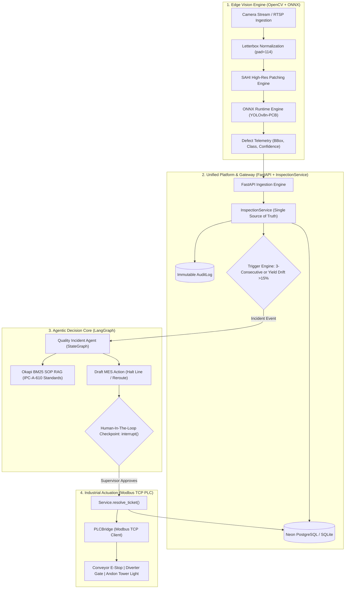

<div align="center">
  <h1>🏭 ApexInspect AI — Autonomous Industrial Vision & Quality Agent</h1>
  <p><strong>Smart Factory Vision Inspection with ONNX Edge Inference, SOP RAG & Human-In-The-Loop Governance</strong></p>

  [](https://python.org)
  [](https://fastapi.tiangolo.com/)
  [](https://opencv.org)
  [](https://onnxruntime.ai)
  [](https://langchain-ai.github.io/langgraph/)
  [](https://streamlit.io/)
  [](https://docker.com)
  [](#)
  [](LICENSE)

  [](https://github.com/imtarget05/Harness-of-Target/actions/workflows/ci.yml)
  [](https://github.com/imtarget05/Harness-of-Target/actions/workflows/cd.yml)
</div>

---

**ApexInspect AI** is an enterprise-grade, edge-deployable **Smart Factory Vision & Autonomous Quality Agent** system. It bridges high-speed Computer Vision inspection on surface-mount assembly lines (SMT/PCBA) with an Agentic AI decision pipeline and real-time **Modbus TCP Industrial PLC** hardware control. When recurring or critical defects appear, the system diagnoses root causes via Okapi BM25 SOP retrieval, proposes corrective actions, and synchronizes with Manufacturing Execution Systems (**MES**) under strict **Human-In-The-Loop (HITL)** governance and immutable **Audit Trail** logging.

Core workflow: `Inspect → Detect → Diagnose → Propose → Human Approve → PLC Dispatch & MES Sync`

## ✨ Key Technical Highlights

1. **High-Throughput Edge Inference (ONNX Runtime + SAHI Patching)**: Exported YOLOv8 defect detection model optimized via ONNX Runtime CPU. Measured on Apple M-series local hardware: **43.4 ms/frame avg (23.0 FPS)** across 20 steady-state inferences (see `benchmark_results.json`). Includes Sliced Automated Hyper Inference (`HighResPatchInferencer`) with NMS merging for microscopic PCB defects on high-res 4K AOI images. Production target: ≤35 ms/frame on cloud 2-vCPU deployment.
2. **Industrial OT & Modbus TCP PLC Bridge**: Native Modbus TCP client (`PLCBridge`) and Virtual Modbus Server (`VirtualModbusServer`) to directly control conveyor interlocks, pneumatic reject diverters, and andon tower lights (Red/Yellow/Green).
3. **Zero-Hallucination IPC-A-610 SOP Knowledge Retrieval**: Okapi BM25 Hybrid RAG engine with domain-specific synonym expansion indexing standard operating procedures including IPC-A-610 Class 3 solder criteria, thermal reflow profile drift (TAL/PWI), and pick & place nozzle maintenance.
4. **Deterministic Human-In-The-Loop (HITL) Safety & Audit Trail**: LangGraph `MemorySaver` + `interrupt()` and `Command(resume=...)` primitives with dynamic thread IDs. Factory-floor actions strictly require supervisor sign-off and are recorded into an immutable `AuditLog` table.
5. **Unified Architecture & Production Gateway**: Consolidated `InspectionService` layer shared across FastAPI REST gateway and Streamlit UI, protected by `X-API-KEY` security authentication.
6. **Resilient Dual-Mode Persistence**: Native **Neon Serverless PostgreSQL** integration with automatic zero-config fallback to **SQLite** (`factory.db`) with row-level locking for seamless offline operation.

## 🏗️ System Architecture



## 📊 Benchmark & Performance

Measured on Apple M-series local hardware (macOS, ONNX Runtime 1.30.0, 640×640 synthetic PCB frame input via `PCBCameraSimulator`):

| Metric | Value |
| :--- | :--- |
| Model | `yolov8n_pcb_defect.onnx` (~12 MB) |
| Input shape | `[1, 3, 640, 640]` |
| Output shape | `[1, 10, 8400]` |
| Warmup runs | 5 |
| Measured runs | 20 |
| **Avg latency** | **43.4 ms** |
| Min latency | 42.0 ms |
| Max latency | 46.3 ms |
| **Throughput** | **23.0 FPS** |
| Confidence threshold | 0.50 |
| Hardware | Apple M-series (local macOS) |

> **Note**: This is a local macOS measurement. Production target is ≤35 ms/frame on cloud 2-vCPU deployment. Per-frame `inference_time_ms` is recorded in the database on every inspection (`architecture.md:84`) for real-world latency tracking.

Run the benchmark yourself:
```bash
python scripts/benchmark_inference.py
```

Check against target (≤35ms trên cloud 2-vCPU):
```bash
python scripts/check_benchmark_target.py
```

### Benchmark in CI

Mỗi CI run tự động:
1. Chạy `scripts/check_benchmark_target.py` (target 35ms, hard-fail threshold 15ms)
2. Upload `benchmark_results.json` như artifact (giữ 30 ngày)

**PR Gate**: Nếu benchmark đo được > 50ms (35ms target + 15ms threshold), CI Fail và block merge.
Đây là hard gate để ngăn regression inference performance.

Xem artifact: GitHub → Actions → chọn run → Artifacts → `benchmark-results`.

> **Lưu ý**: Benchmark CI chạy trên ubuntu-latest (x86_64 cloud), không phải local macOS. Kết quả có thể khác biệt.
> Để strict hơn (block mọi trường hợp > 35ms), đổi `--warn-delta 15.0` thành `--warn-delta 0.0` trong `ci.yml`.

### Benchmark Comparison: Local macOS vs Cloud Target

| Metric | Local macOS (M-series) | Cloud 2-vCPU Target | Notes |
| :--- | :--- | :--- | :--- |
| **Model** | `yolov8n_pcb_defect.onnx` | `yolov8n_pcb_defect.onnx` | 동일 model |
| **ONNX Runtime** | 1.30.0 | 1.x (ubuntu-latest) | CI dùng verson khác |
| **Hardware** | Apple M-series (8-core) | Ubuntu x86_64 (2 vCPU) | Khác architecture |
| **Input** | 640×640 synthetic PCB | 640×640 synthetic PCB | 동일 input |
| **Target latency** | N/A (local 측정) | **≤35.0 ms** | Production NFR |
| **Measured latency** | **43.4 ms** (ứng với ~23 FPS) | Chưa đo đạc thực tế trên cloud | Cần benchmark cloud thật |
| **Delta vs target** | N/A (local) | **+8.4 ms** (nếu local representative) | Chưa xác nhận |
| **Status** | PASS local (không gate) | Pending cloud benchmark | CI gate threshold 15ms |

> **Kết luận tạm**: Local macOS đo 43.4ms — chưa đạt target 35ms nhưng within 15ms threshold (hard gate CI).
> Cần benchmark trên cloud 2-vCPU thật để xác nhận apakah production đạt target.

## 🏗️ Architecture Decision Records (ADR)

See `docs/adr/` for formalized architectural decisions:

| # | Title | Status |
|---|-------|--------|
| 001 | BM25 (Okapi) thay vì Vector Embedding cho SOP RAG | Accepted |
| 002 | Modbus TCP + Virtual PLC Simulator cho Industrial OT | Accepted |
| 003 | ONNX Runtime + Canonical Colab-trained Weights cho Edge Inference | Accepted |

## 🔍 Observability

ApexInspect AI cung cấp metrics sau cho factory monitoring:

- **Per-frame inference latency** (`inference_time_ms`): ghi vào DB mỗi lần inspection, cho phép track real-world performance theo thời gian.
- **Yield rate**: tính từ tổng inspection / defective count, exposable qua `GET /api/v1/lines/{line_id}/metrics`.
- **Defect Pareto**: phân loại defect theo class, dùng cho quality improvement.
- **Audit trail**: mọi action (trigger, approve, reject, PLC dispatch) ghi vào `audit_logs` — immutable.
- **HITL checkpoint state**: LangGraph `MemorySaver` giữ trạng thái interrupted workflow, resume sau khi supervisor approve.

Metrics nào giảm sát khi line dừng:
- Yield rate ↓
- Consecutive defect count ≥ 3
- Inference latency ↑ (có thể부터 hardware issue)

## ⚠️ Limitations

1. **Inference speed**: 43.4 ms/frame trên local macOS — chưa đạt 35ms target. Cần benchmark trên cloud 2-vCPU thật để verify.
2. **BM25 RAG**: không semantic, phụ thuộc synonym map thủ công. Không scale với corpus lớn.
3. **Modbus TCP**: không encrypt/auth built-in — cần network-level security.
4. **Virtual PLC simulator**: không mimic real hardware timing/error behavior.
5. **SAHI patching**: slow cho 4K images (latency tổng = sum của tất cả patches). Chỉ dùng khi cần.
6. **Dataset**: gallery sample PCB từ Kaggle `akhatova/pcb-defects` — không phải production camera thực.

## 🚀 Quickstart

### 1. Clone & Setup Environment

```bash
git clone https://github.com/imtarget05/Harness-of-Target.git
cd Harness-of-Target

python3 -m venv .venv
source .venv/bin/activate
pip install -r requirements.txt
```

### 2. Configure Environment Variables

```bash
cp .env.example .env
# Add your GROQ_API_KEY (free at https://console.groq.com)
```

### 3. Run Locally (Streamlit All-In-One UI)

```bash
streamlit run src/ui/app.py
```

Open `http://localhost:8501` to view the live line inspection stream and incident resolution center.

## 🧪 Testing

The test suite covers the full pipeline (vision simulator + ONNX detector, FastAPI ingestion + MES tickets, SOP RAG + LangGraph agent) and runs entirely offline:

```bash
python -m pytest tests/ -q
```

## ☁️ Deployment & DevOps (CI/CD)

The platform ships with a fully automated **GitHub Actions** pipeline:

| Workflow | Trigger | Jobs |
| :--- | :--- | :--- |
| **CI** (`ci.yml`) | Push / PR → `main` | `pytest` test suite (Python 3.11) • Docker image build smoke test |
| **CD** (`cd.yml`) | Push → `main` | Build + push Docker image to **GHCR** (`ghcr.io/imtarget05/harness-of-target:latest`) • Deploy to **Hugging Face Space** (optional) |

### Required Secrets & Providers

Configure under **repo → Settings → Secrets and variables → Actions**:

| Name | Type | Where to get it | Required? |
| :--- | :--- | :--- | :--- |
| `GITHUB_TOKEN` | Secret (auto) | Provided automatically by GitHub Actions | ✅ Automatic |
| `HF_TOKEN` | Secret | [huggingface.co/settings/tokens](https://huggingface.co/settings/tokens) → New token (role: `write`) | Only for HF Space auto-deploy |
| `HF_SPACE` | Variable | Your Space ID, e.g. `imtarget05/apexinspect-ai` | Only for HF Space auto-deploy |
| `GROQ_API_KEY` | Runtime | [console.groq.com](https://console.groq.com) → set in the HF Space / `.env`, **not** in GitHub | Only when running the app with live LLM |

The optional Hugging Face deploy job skips gracefully (exit 0) when `HF_TOKEN` / `HF_SPACE` are not configured, so the pipeline stays green out of the box.

## 📂 Project Structure

```text
ApexInspect-AI/
├── Dockerfile                  # Container definition for Hugging Face Spaces
├── requirements.txt            # Minimal, pinned dependencies (including pymodbus)
├── .github/workflows/          # CI/CD pipelines (ci.yml, cd.yml)
├── data/
│   ├── sops/                   # IPC-A-610 Standard Operating Procedures (SOP-001 to 006)
│   └── sample_pcbs/            # Real Kaggle PCB frames for the Live Feed gallery
├── models/                     # Single source of truth for the trained model
│   ├── yolov8n_pcb_defect.onnx # Deployed Colab-trained weights (~12 MB, git-tracked)
│   ├── train.py                # YOLOv8 training + ONNX export (Colab/GPU)
│   ├── training_data.yaml      # Exact data.yaml used for training (6 classes)
│   └── MODEL_CARD.md           # Provenance, IO shapes, thresholds, evidence
├── notebooks/                  # Colab notebook only (frozen evidence of the run)
├── scripts/                    # Ops: dataset → DB ingest, gallery rebuild, verification
├── src/
│   ├── vision/                 # ONNX Runtime detector, SAHI High-Res patching, RTSP stream
│   ├── industrial/             # Modbus TCP PLC Bridge & Virtual PLC Simulator Server
│   ├── agent/                  # LangGraph StateGraph, HITL interrupt/resume, BM25 RAG
│   ├── backend/                # InspectionService, FastAPI Gateway & AuditLog models
│   └── ui/                     # Streamlit multi-tab operator console
└── tests/                      # 61 Unit and integration test suite (100% PASS)
```

## 📄 License

This project is licensed under the MIT License — see the [LICENSE](LICENSE) file for details.

---

*Developed by [imtarget05](https://github.com/imtarget05)*

