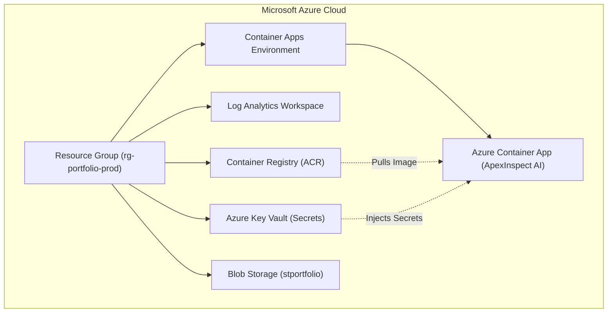

# 🏗️ Terraform Infrastructure as Code (IaC) — Azure Deployment

Thư mục này chứa mã nguồn **Terraform** chuẩn doanh nghiệp để tự động hóa khởi tạo toàn bộ hạ tầng điện toán đám mây trên **Microsoft Azure** cho dự án **ApexInspect AI**.

---

## 📦 Kiến Trúc Tài Nguyên Được Quản Lý Bởi Terraform



---

## 🚀 Hướng Dẫn Thực Thi Bằng Terraform CLI

### 1. Cài đặt Terraform (nếu chưa có)
```bash
brew install terraform
```

### 2. Đăng nhập Azure CLI
```bash
az login
```

### 3. Khởi tạo & Cấu hình Biến
```bash
cd deploy/terraform
cp terraform.tfvars.example terraform.tfvars
# Chỉnh sửa file terraform.tfvars nếu cần đổi API key hoặc Region
```

### 4. Lập kế hoạch (Plan) & Áp dụng (Apply)
```bash
# Khởi tạo Terraform provider (azurerm)
terraform init

# Xem trước các tài nguyên sẽ được tạo trên Azure
terraform plan

# Khởi tạo toàn bộ hạ tầng thực tế
terraform apply -auto-approve
```

### 💡 Lưu ý về Chi Phí:
Tài nguyên `azurerm_container_app` được cấu hình với thuộc tính `min_replicas = 0`. Khi không có người truy cập, hệ thống tự động co về 0 container (Scale to Zero = **0 VNĐ**).

### 5. Dọn dẹp tài nguyên khi không dùng nữa
```bash
terraform destroy
```
