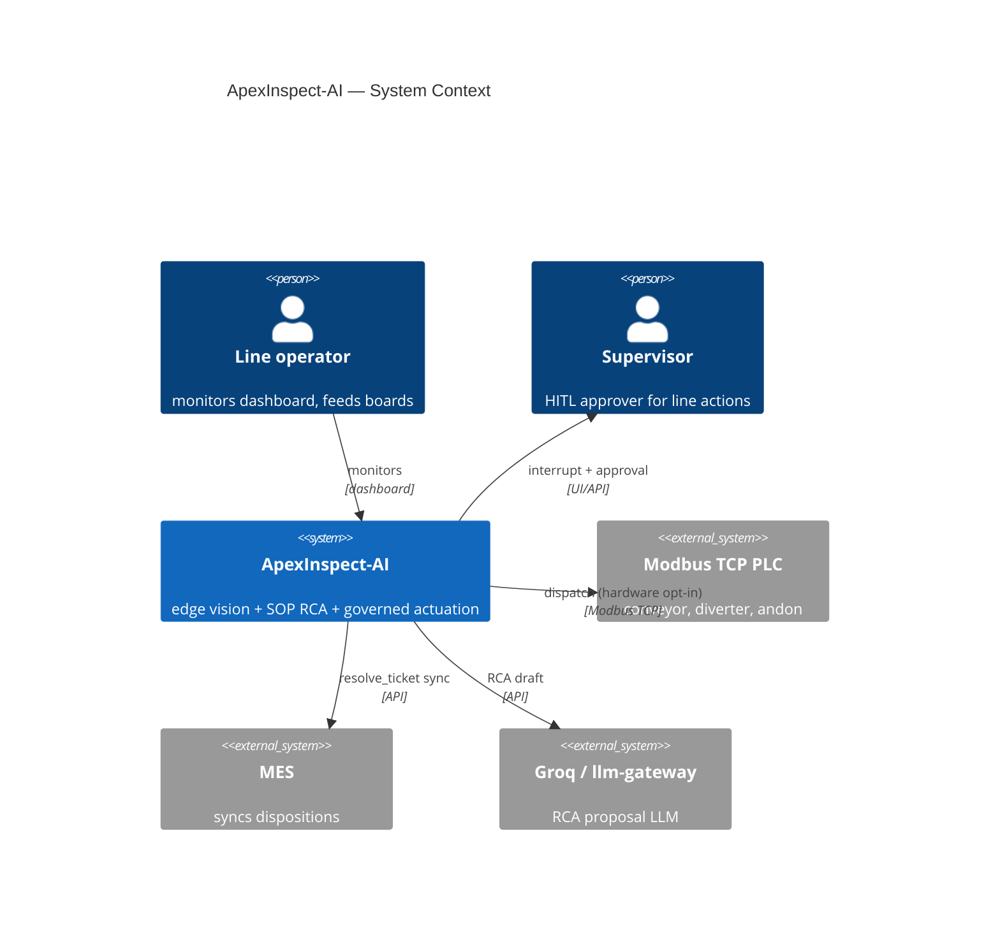
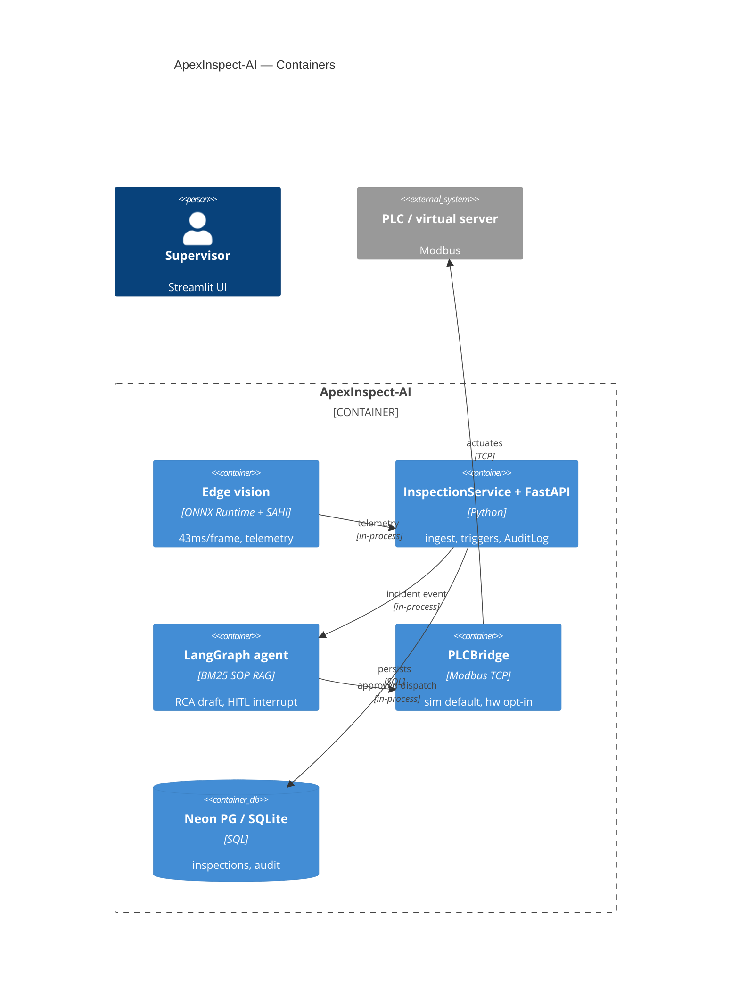

# ApexInspect-AI — C4 Architecture

> Source of truth: `ApexInspect-AI/README.md` system-architecture flowchart
> (`Inspect → Detect → Diagnose → Propose → Human Approve → PLC Dispatch & MES Sync`).

## C4-Context

## C4-Container

