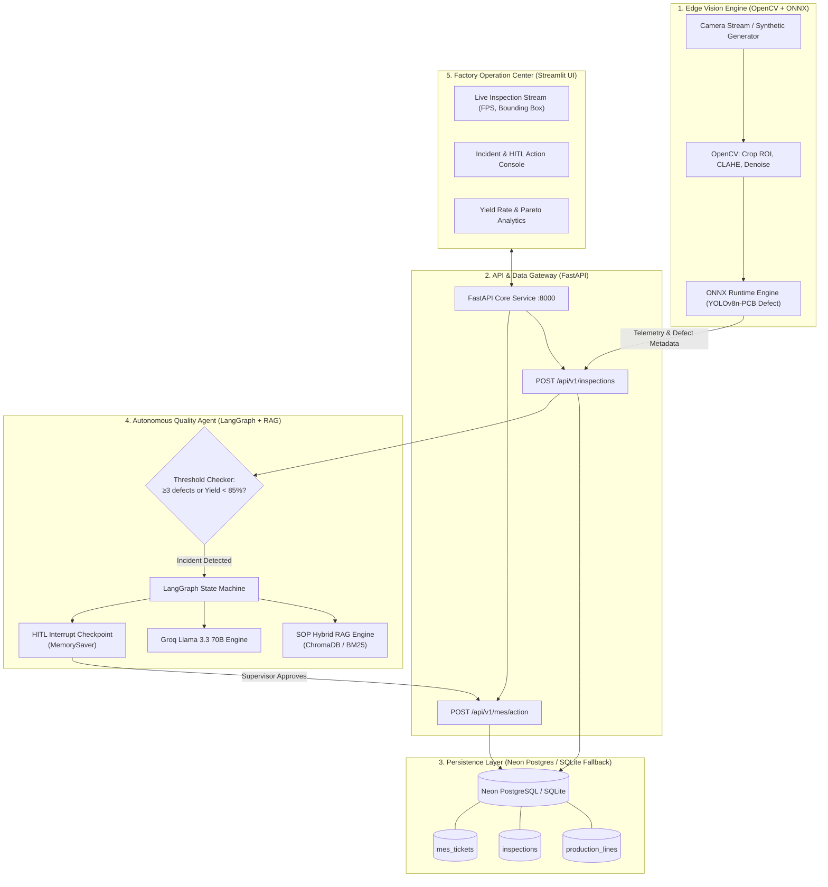
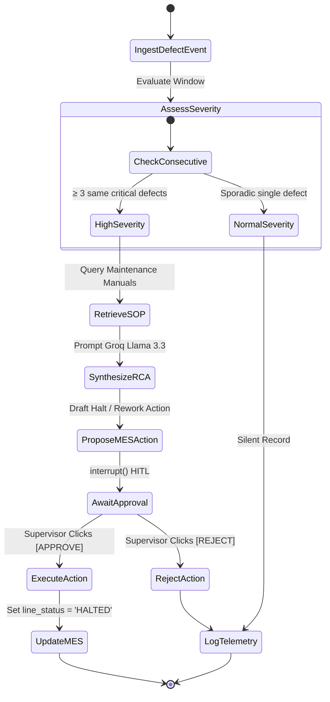

# Technical System Architecture: ApexInspect AI

## 0. DEPLOYMENT CHỐT: Edge-First (Offline On-Premise)

- **Edge inference (luồng chính, offline 100%)**: Camera → OpenCV → YOLOv8 ONNX
  (target ≤15ms/frame tại Edge PC công nghiệp) → RCA Local/Deterministic
  (Heuristic rule-based + BM25 inference thuần) → HITL → PLC Modbus TCP tại chỗ.
- **Control Plane (async-only, không nằm luồng chính)**: Edge đẩy báo cáo bất đồng bộ
  (inspections/tickets/audit) lên Cloud (Neon/Render/Groq). Mất mạng: Edge vẫn chạy đủ.
- Training duy nhất trên Colab (Vision finetune YOLOv8n, `colab/train_yolo_T4.ipynb`).

## 1. System Topology & End-to-End Flow



---

## 2. Database Schema Design (SQLAlchemy & PostgreSQL)

```sql
-- Dây chuyền sản xuất
CREATE TABLE production_lines (
    line_id VARCHAR(50) PRIMARY KEY,
    name VARCHAR(100) NOT NULL,
    status VARCHAR(20) DEFAULT 'RUNNING',  -- 'RUNNING', 'WARNING', 'HALTED'
    current_product VARCHAR(100) NOT NULL,
    target_yield_rate FLOAT DEFAULT 95.0,
    updated_at TIMESTAMP DEFAULT CURRENT_TIMESTAMP
);

-- Dữ liệu kiểm định từng sản phẩm từ camera
CREATE TABLE inspections (
    inspection_id VARCHAR(64) PRIMARY KEY,
    line_id VARCHAR(50) REFERENCES production_lines(line_id),
    timestamp TIMESTAMP DEFAULT CURRENT_TIMESTAMP,
    image_filename VARCHAR(255),
    is_defective BOOLEAN NOT NULL,
    defect_classes TEXT[],                 -- Mảng các loại lỗi phát hiện được
    confidence_scores FLOAT[],             -- Điểm tin cậy tương ứng
    bounding_boxes JSONB,                  -- Tọa độ [x1, y1, x2, y2] của từng lỗi
    inference_time_ms FLOAT NOT NULL
);

-- Phiếu điều phối sự cố MES (Maintenance & Dispatch Tickets)
CREATE TABLE mes_tickets (
    ticket_id VARCHAR(64) PRIMARY KEY,
    line_id VARCHAR(50) REFERENCES production_lines(line_id),
    severity VARCHAR(20) NOT NULL,         -- 'LOW', 'MEDIUM', 'CRITICAL'
    trigger_reason TEXT NOT NULL,          -- Lý do kích hoạt cảnh báo
    root_cause_analysis TEXT NOT NULL,     -- Phân tích nguyên nhân từ AI
    recommended_sop VARCHAR(100) NOT NULL, -- Quy trình chuẩn đề xuất
    action_type VARCHAR(50) NOT NULL,      -- 'HALT_LINE', 'ROUTE_REWORK', 'CALIBRATE'
    status VARCHAR(20) DEFAULT 'PENDING_APPROVAL', -- 'PENDING_APPROVAL', 'APPROVED', 'REJECTED'
    approved_by VARCHAR(100),
    thread_id VARCHAR(100),                -- LangGraph checkpoint thread identifier
    created_at TIMESTAMP DEFAULT CURRENT_TIMESTAMP,
    resolved_at TIMESTAMP
);

-- Bảng kiểm toán bất biến (Immutable Audit Trail)
CREATE TABLE audit_logs (
    log_id VARCHAR(64) PRIMARY KEY,
    timestamp TIMESTAMP DEFAULT CURRENT_TIMESTAMP,
    operator_id VARCHAR(100) NOT NULL,
    action VARCHAR(50) NOT NULL,           -- 'TRIGGER_CONSECUTIVE_DEFECTS', 'APPROVE_ACTION', 'RESUME_LINE'
    line_id VARCHAR(50) NOT NULL,
    ticket_id VARCHAR(64),
    details TEXT,
    source_ip VARCHAR(50)
);
```

---

## 3. LangGraph State Machine Architecture

### Workflow Nodes & Decision Matrix


### Typed State Schema
```python
from typing import List, Optional, Dict, Any
from pydantic import BaseModel

class QualityAgentState(BaseModel):
    line_id: str
    recent_inspections: List[Dict[str, Any]] = []
    consecutive_defect_count: int = 0
    defect_type: str = ""
    severity: str = "NORMAL"               # NORMAL, MEDIUM, CRITICAL
    sop_references: List[str] = []         # Trích dẫn từ kho tri thức
    root_cause_explanation: str = ""       # Phân tích nguyên nhân
    proposed_action: str = ""              # HALT_LINE, ROUTE_REWORK
    ticket_id: Optional[str] = None
    approval_status: str = "PENDING"       # PENDING, APPROVED, REJECTED
```

---

## 4. REST API Endpoint Specifications

### Ingestion API
- `POST /api/v1/inspections`
  - Body:
    ```json
    {
      "line_id": "SMT-LINE-01",
      "is_defective": true,
      "defect_classes": ["short_circuit"],
      "confidence_scores": [0.89],
      "bounding_boxes": [[120, 85, 180, 140]],
      "inference_time_ms": 28.5
    }
    ```
  - Response:
    ```json
    {
      "status": "RECORDED",
      "incident_triggered": true,
      "ticket_id": "TICK-20260915-001"
    }
    ```

### Incident & Action Approval API
- `POST /api/v1/mes/approve`
  - Body:
    ```json
    {
      "ticket_id": "TICK-20260915-001",
      "action": "APPROVE",
      "approved_by": "supervisor_tan"
    }
    ```
  - Response:
    ```json
    {
      "status": "EXECUTED",
      "line_id": "SMT-LINE-01",
      "new_line_status": "HALTED",
      "message": "Dây chuyền SMT-LINE-01 đã tạm dừng thành công để bảo trì."
    }
    ```

### Factory Metrics API
- `GET /api/v1/lines/{line_id}/metrics`
  - Response:
    ```json
    {
      "line_id": "SMT-LINE-01",
      "status": "RUNNING",
      "total_inspected": 1420,
      "defects_count": 48,
      "yield_rate": 96.62,
      "avg_inference_ms": 26.8
    }
    ```
